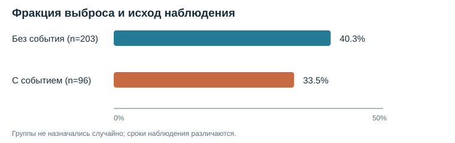

# Сердечная недостаточность: гипотеза, проверка, план A/B-теста

Взял [набор клинических записей на Kaggle](https://www.kaggle.com/datasets/andrewmvd/heart-failure-clinical-data) и проверил, различается ли фракция выброса между группами с разным исходом наблюдения. Вторая часть проекта - план A/B-теста для цифрового сервиса наблюдения. Это отдельный пример дизайна эксперимента: в клиническом CSV нет групп A и B.

## Что получилось

В файле 299 записей. У 96 пациентов отмечен `DEATH_EVENT=1`, у 203 - `DEATH_EVENT=0`. Пропусков и полных дублей нет.

- Без события: 203 записи, средняя фракция выброса 40,27%.
- С событием: 96 записей, средняя фракция выброса 33,47%.

Разница средних составляет **-6,80 процентного пункта** для группы с событием относительно группы без события. Двусторонний перестановочный тест с 50 000 перестановок дал `p < 0,00002`. Бутстреп-интервал 95% для разницы: **от -9,68 до -3,92 п.п.** Код и точные значения есть в [summary.json](output/summary.json).



Это описательная связь. Группы не назначались случайно, а сроки наблюдения различаются. По такому сравнению нельзя оценить действие лечения или делать вывод для отдельного пациента. Я также не использовал `time` как обычный исходный признак: это длительность наблюдения, а не характеристика пациента на старте.

## Гипотеза и метод

**H0:** средняя фракция выброса одинакова в группах `DEATH_EVENT=0` и `DEATH_EVENT=1`.

**H1:** средние различаются. Порог для учебной проверки - 0,05. Статистика - разница средних в процентных пунктах. Я сохранил размеры групп и 50 000 раз перемешал метки исхода. Долю перестановок с разницей не меньше наблюдаемой по модулю взял как двустороннее `p` с поправкой `+1` в числителе и знаменателе. Для интервала 20 000 раз взял выборку с возвращением внутри каждой группы.

Выбор гипотезы сделан после знакомства с набором. Поэтому результат нельзя считать заранее зарегистрированной проверкой. Другие показатели в файле я не перебирал в поиске минимального `p`.

## План A/B-теста для цифрового сервиса

В [плане эксперимента](docs/ab_experiment.md) я описал тест напоминания в цифровом сервисе: единицу рандомизации, основную метрику, защитные метрики, расчёт выборки и правило решения. [Код](src/ab_plan.py) считает размер групп и проверяет разницу долей для двух независимых групп. Числа в примере искусственные и не относятся к пациентам из CSV.

## Запуск

Нужен Python 3.10+.

```bash
python -m pip install -r requirements.txt
python src/analyze.py
python src/ab_plan.py
python -m unittest discover -s tests
```

Первый скрипт обновит [JSON с результатами](output/summary.json) и SVG-график. Фиксированный seed делает расчёт повторяемым.

## Данные

- [Карточка на Kaggle](https://www.kaggle.com/datasets/andrewmvd/heart-failure-clinical-data).

Анализ нужен для практики работы с данными и статистикой. Он не служит медицинской рекомендацией.
